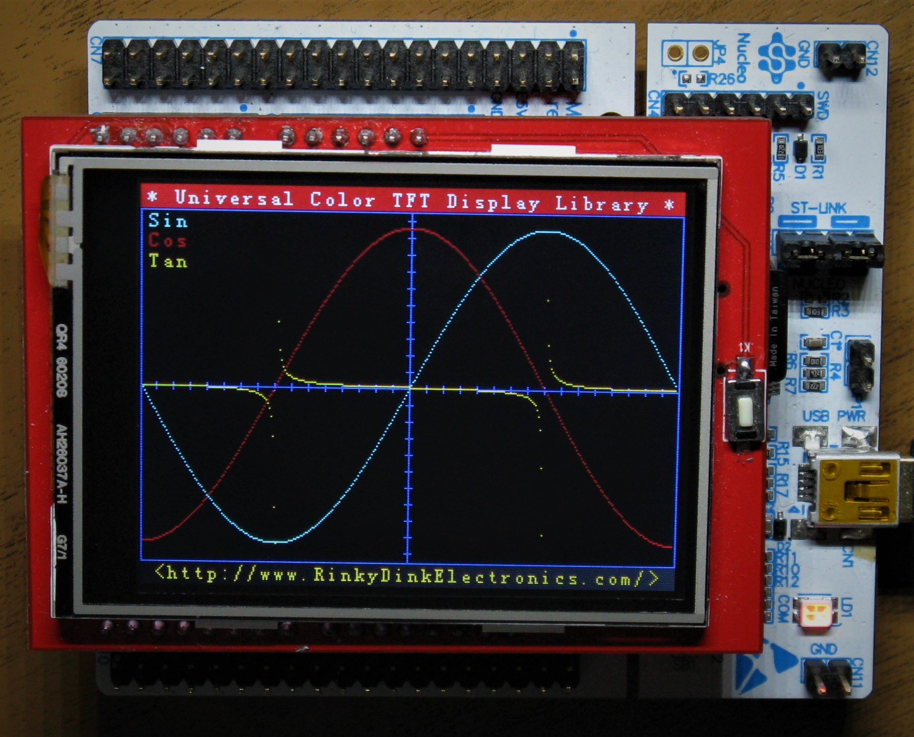

### Description
I presume you have an IDE, in this example I use SW4STM32 (Eclipse), STM32CubeMX and UTFT.

You can download all from STMicroelectronics and  from [here](http://www.rinkydinkelectronics.com).

Compile the project and program your controller.

The display should look like this. 

harebit

